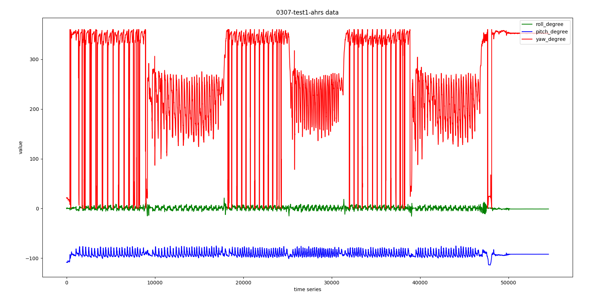
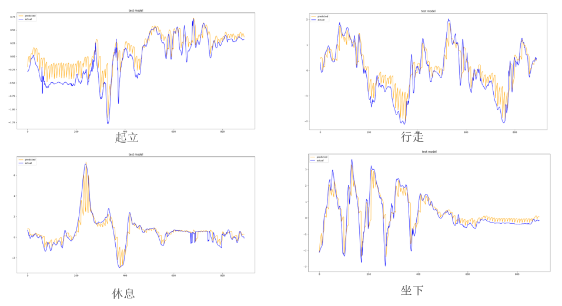

# ForecastBasedGraph

## 主要思路
	1、实体机器人通过云脑机器人架构，在云端形成了克隆模型的虚拟机器人，每个虚拟机器人拥有实体机器人的传感器数据。
    2、信息融合：通过将多维度的传感器数据通过Auto Encoder进行降维和去噪，形成高浓缩的特征，使得下游其他机器学习任务更加精确。
    3、利用基于LSTM的seq2seq进行预测

## 实验结果

1、实时传感器数据如下图所示：

2、通过Auoto Encoder降低到一维之后如下图所示：

3、利用seq2seq进行预测：利用前100个点(1s)的数据预测往后10(0.1s)的数据值

